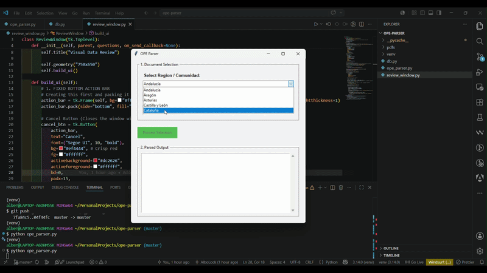

# OPE Parser

A fast Python tool for extracting questions and answers from official spanish nursing exam PDFs.

## About

OPE Parser is a personal utility I built to quickly extract and parse questions and answers from official PDF spanish nursing exam documents. Instead of manually copying and organizing questions, this tool automates the extraction process, making it easy to build question banks and study materials.

## What It Does

- Parses nursing exam PDF files
- Automatically extracts questions and answers
- Structures the data for easy access and analysis
- Handles the tedious manual extraction work

## Tech Stack

- **Python** - Core implementation

## Personal Project

This is a personal utility built for my own needs. Feel free to explore the code and adapt it for your use case!
